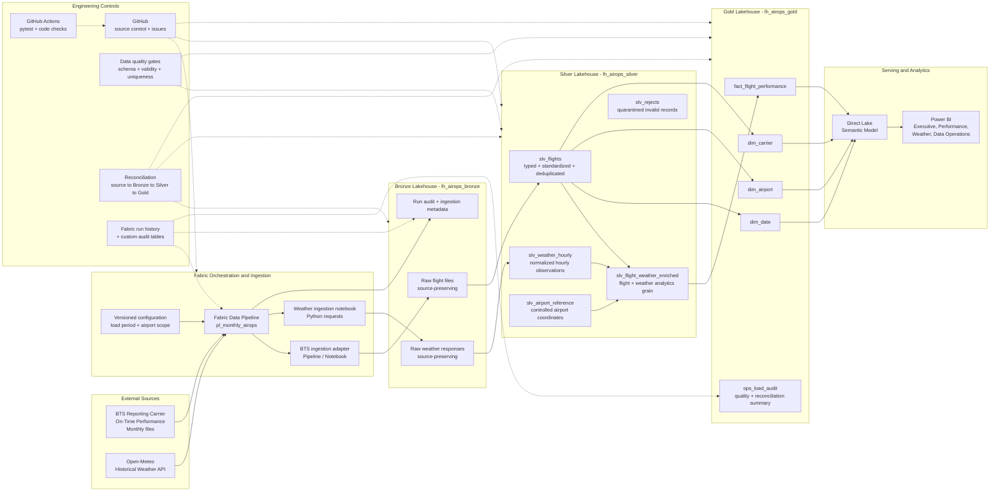
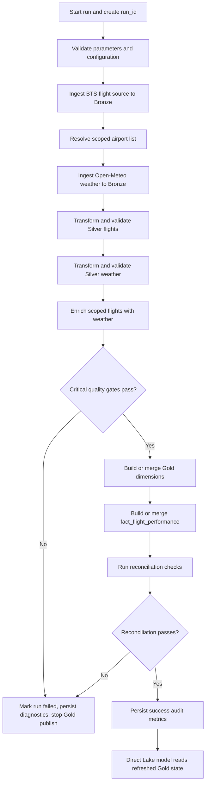
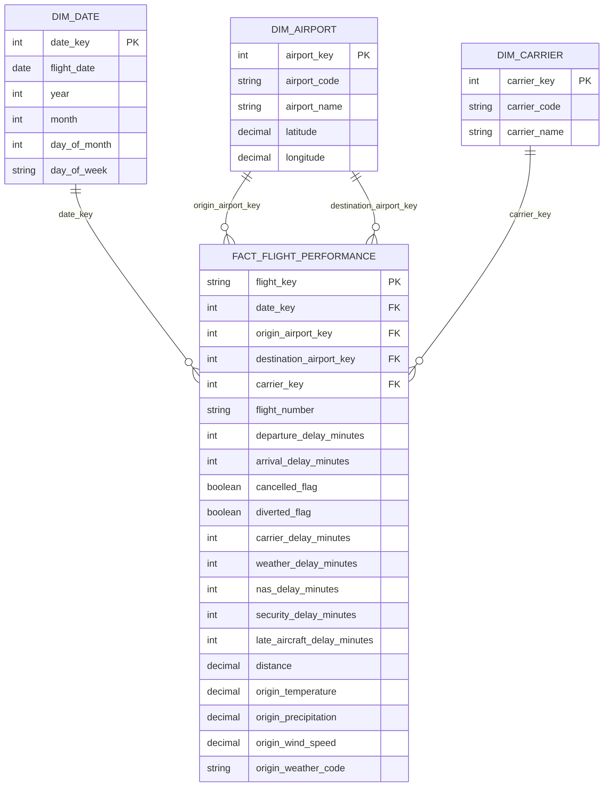

# AirOps 360 Architecture

**Version:** 0.1  
**Status:** Accepted for MVP foundation  
**Date:** 2026-08-25  
**Scope authority:** `docs/PROJECT_SCOPE.md`  
**Decision log:** `docs/DECISIONS.md`

## 1. Purpose

This document defines the implementation architecture for the AirOps 360 MVP. The design intentionally balances production-style engineering practices with portfolio-project feasibility. It is designed to demonstrate Microsoft Fabric data engineering, medallion architecture, Delta Lake, PySpark, SQL, incremental processing, data quality, reconciliation, observability, Direct Lake, Power BI, Git, and automated testing without expanding into streaming, machine learning, or unrelated platform complexity.

The controlling scope remains `docs/PROJECT_SCOPE.md`. If this document and the scope document conflict, the scope document wins.

## 2. Architecture principles

1. **Preserve raw source truth.** Bronze retains source data with ingestion metadata and no business-rule rewriting.
2. **Improve quality by layer.** Silver standardizes, validates, deduplicates, and enriches. Gold contains analytics-ready business entities.
3. **Use deterministic, repeatable processing.** The same source batch can be rerun without creating duplicate business records.
4. **Separate orchestration from transformation.** Fabric Data Pipelines coordinate work; notebooks and reusable Python/PySpark logic perform data processing.
5. **Make quality measurable.** Structural, completeness, validity, uniqueness, reconciliation, and weather-coverage checks are explicit outputs of each load.
6. **Treat operations as a first-class data product.** Every run records counts, status, timestamps, and failure information.
7. **Keep the MVP intentionally batch-oriented.** Real-time streaming, Kafka, Eventstream, and ML prediction are outside the approved MVP scope.
8. **Keep the architecture portfolio-feasible.** The MVP uses one Fabric workspace with three logically separated lakehouses rather than introducing multi-workspace enterprise administration before the core product is complete.

## 3. Logical architecture



## 4. Fabric deployment model

### MVP deployment

The MVP uses one Fabric workspace with three lakehouses:

| Layer | Fabric item | Purpose |
|---|---|---|
| Bronze | `lh_airops_bronze` | Raw source preservation and ingestion metadata |
| Silver | `lh_airops_silver` | Validated, typed, deduplicated, reusable data |
| Gold | `lh_airops_gold` | Curated dimensional model and operational summary |

This keeps the medallion boundaries explicit while avoiding unnecessary workspace administration for a single-developer portfolio project. A production enterprise implementation could separate the layers into dedicated workspaces to strengthen governance and access control.

### Storage format

- Bronze preserves the original source representation wherever practical.
- Silver tables use Delta Lake.
- Gold tables use Delta Lake.
- Power BI consumes curated Gold tables through Direct Lake.

## 5. Source architecture

### 5.1 BTS flight data

**Source:** U.S. DOT Bureau of Transportation Statistics, Reporting Carrier On-Time Performance.  
**MVP period:** April 2026 through June 2026.

Load pattern:

- April 2026: historical baseline
- May 2026: historical baseline
- June 2026: incremental demonstration batch

Bronze path convention:

```text
Files/raw/flights/year=2026/month=04/
Files/raw/flights/year=2026/month=05/
Files/raw/flights/year=2026/month=06/
```

Each load records source identifier, load period, ingestion timestamp, file name or source URI, run ID, and row-count metadata.

### 5.2 Open-Meteo weather data

Weather is retrieved only for the controlled airport scope defined for the MVP. The intended scope is approximately 15 high-volume airports represented in the flight data.

The first baseline profiling step determines the airport set by flight volume. The approved set is then frozen in version-controlled configuration so later runs are reproducible.

Bronze path convention:

```text
Files/raw/weather/airport=ATL/year=2026/month=04/
Files/raw/weather/airport=DFW/year=2026/month=04/
...
```

Representative variables include temperature, precipitation, rain, snowfall, weather code, wind speed, wind gusts, and visibility where available.

## 6. Orchestration design

The primary orchestration item is:

```text
pl_monthly_airops
```

Planned parameters:

| Parameter | Example | Purpose |
|---|---|---|
| `p_year` | `2026` | Target year |
| `p_month` | `06` | Target month |
| `p_load_mode` | `incremental` | Historical or incremental execution |
| `p_run_id` | generated | End-to-end traceability |

### Pipeline sequence



Gold publication is gated. Critical quality or reconciliation failures prevent a bad batch from being treated as successfully published.

## 7. Bronze design

Bronze is the immutable landing zone for the MVP.

### Responsibilities

- Preserve source values.
- Capture source and ingestion metadata.
- Partition logically by load period and source.
- Support reruns without overwriting evidence from prior runs.
- Provide the row-count baseline used by reconciliation.

### Metadata fields

Every Bronze ingestion should make the following metadata available either as columns or in the load-audit table:

- `run_id`
- `source_name`
- `source_object`
- `load_year`
- `load_month`
- `ingested_at_utc`
- `source_row_count`
- `ingestion_status`

## 8. Silver design

Silver is the reusable engineering layer.

### Core tables

#### `slv_flights`

Responsibilities:

- normalize column names
- cast data types
- validate dates and airport codes
- normalize carrier identifiers
- derive scheduled departure hour
- derive delay/cancellation/diversion flags
- generate deterministic flight key
- deduplicate
- preserve source lineage fields

A candidate business key is:

```text
FlightDate + Reporting_Airline + Flight_Number_Reporting_Airline + Origin + Dest + CRSDepTime
```

This key is provisional until profiling confirms uniqueness. If profiling identifies collisions, the key definition will be amended through the decision log rather than silently changed.

#### `slv_weather_hourly`

Grain:

```text
one airport + one observation hour
```

Responsibilities:

- normalize API payloads
- standardize timestamps
- attach airport code
- retain selected weather metrics
- detect missing expected observations

#### `slv_airport_reference`

Controlled reference data containing the approved MVP airport code, airport name, latitude, longitude, and timezone information required for weather requests and timestamp alignment.

#### `slv_flight_weather_enriched`

MVP weather join strategy:

```text
Origin airport + scheduled departure hour
```

This keeps the first version analytically useful and technically feasible. Destination-weather enrichment is not required by the current MVP and would require an approved scope change if added before MVP completion.

#### `slv_rejects`

Contains row-level records rejected from normal Silver processing with:

- `run_id`
- source reference
- rejection rule
- rejection reason
- rejection timestamp

## 9. Gold dimensional model



The exact physical column list may evolve during profiling, but the fact grain and core dimensional relationships should remain stable.

### Fact grain

```text
one scheduled carrier flight occurrence
```

### Gold design rules

- Surrogate keys are used for dimensions where appropriate.
- The deterministic `flight_key` remains available for idempotency and traceability.
- Weather-derived attributes required for MVP analytics are carried into the curated fact rather than introducing an unnecessary weather dimension.
- Gold contains only trusted records that have passed the required quality and reconciliation gates.

## 10. Incremental and idempotent processing

The June 2026 batch demonstrates the incremental pattern.

### Required behavior

1. The pipeline is parameterized by year and month.
2. Bronze lands the incoming batch with run metadata.
3. Silver derives the deterministic flight key and removes duplicates.
4. Gold uses merge/upsert semantics where appropriate.
5. A rerun of June must not create duplicate `flight_key` records.
6. Reconciliation confirms that accepted Silver records are represented correctly in Gold.

### Rerun expectation

For an unchanged source batch:

```text
first run  -> inserts valid new records
second run -> zero duplicate business records created
```

This behavior will be demonstrated and documented later in the project.

## 11. Data quality architecture

Quality is implemented as a set of explicit gates rather than ad hoc notebook checks.

### Hard-fail checks

The pipeline should fail the publish stage when a condition would invalidate the data product, such as:

- required source columns missing
- source cannot be parsed
- critical date or key logic cannot be generated
- duplicate business keys remain after the deduplication stage
- Gold reconciliation does not balance to the accepted Silver population

### Row-level quarantine checks

Individual rows can be routed to `slv_rejects` when they fail row-level validity rules, such as:

- missing critical flight identifiers
- malformed airport codes
- invalid cancelled/diverted domain values
- negative delay-cause values when prohibited by the data contract

### Monitored but non-blocking checks

- weather join coverage
- missing weather observations
- rejected-row rate

Thresholds for warning versus failure will be finalized after source profiling provides a realistic baseline.

## 12. Reconciliation architecture

Every monthly run produces a reconciliation record.

Minimum measures:

| Measure | Purpose |
|---|---|
| Bronze flight row count | Raw source baseline |
| Silver accepted flight count | Valid processed population |
| Silver rejected count | Explain exclusions |
| Silver duplicate count | Explain deduplication |
| Weather join matched count | Enrichment coverage |
| Weather join unmatched count | Explicit missing enrichment |
| Gold fact row count | Published analytics population |

Core relationship:

```text
Bronze source rows
= Silver accepted rows
+ Silver rejected rows
+ explicitly documented duplicate/filtered rows
```

Gold is then reconciled to the accepted Silver business-key population according to merge/upsert behavior.

## 13. Observability and operations

The MVP uses two complementary monitoring mechanisms.

### Fabric-native monitoring

Fabric Data Pipeline run history provides orchestration status, duration, activity execution details, and failure diagnostics.

### Custom operational audit

`ops_load_audit` records at least:

- run ID
- source
- load period
- start timestamp
- end timestamp
- status
- source row count
- processed row count
- rejected row count
- target row count
- weather-match count
- weather-unmatched count
- error message when applicable

This table powers the Data Operations page in Power BI and gives the project a visible operational-control surface.

Workspace-level Eventhouse monitoring is not required for the MVP. It can be considered after the core project is complete if it adds portfolio value without displacing required work.

## 14. Serving architecture

Gold Delta tables are the only approved source for the primary reporting model.

```text
Gold Delta tables
        ->
Direct Lake semantic model
        ->
DAX measures
        ->
Power BI report
```

Planned report pages:

1. Executive Overview
2. Airport and Carrier Performance
3. Weather Impact
4. Data Operations

No report should query raw Bronze data directly.

## 15. Source control and CI

### GitHub

The repository is the source of truth for:

- reusable Python logic
- notebook source where exportable
- SQL
- tests
- configuration
- architecture documentation
- ADRs
- pipeline documentation

### CI

GitHub Actions will eventually run automated checks such as:

- Python test suite with `pytest`
- import/syntax validation
- selected transformation unit tests
- lightweight repository quality checks

Fabric workspace deployment and promotion are deliberately deferred until the core data path is working.

## 16. Security and configuration

- No credentials, secrets, tokens, or environment-specific passwords are committed to GitHub.
- Public source URLs and non-secret configuration may be version controlled.
- Environment-specific values should be parameterized.
- Fabric connections and workspace permissions should be used rather than hard-coded credentials.
- Raw production-sized source files are excluded from the repository.

## 17. Failure-handling strategy

| Failure type | Expected response |
|---|---|
| Source unavailable | Fail ingestion activity, record diagnostics, do not publish Gold |
| Invalid schema | Hard fail quality gate |
| Row-level invalid data | Quarantine row and record reason |
| Weather API partial gap | Continue with measured unmatched coverage unless critical threshold is later approved |
| Duplicate business keys after dedupe | Hard fail |
| Gold reconciliation mismatch | Hard fail publication |
| Rerun of unchanged batch | Complete without duplicate business records |

## 18. Scope boundaries

The following remain explicitly outside architecture v0.1 and the MVP:

- real-time streaming
- Eventstream or Kafka
- ML delay prediction
- real-time flight tracking
- custom web or mobile application
- weather enrichment for every U.S. airport
- Kubernetes
- microservices
- enterprise multi-region deployment

These features must not be added simply to make the architecture appear more complex.

## 19. Architecture acceptance criteria

Architecture v0.1 is accepted when it clearly documents:

- BTS monthly flight files and Open-Meteo as the two sources
- Fabric orchestration and ingestion
- Bronze, Silver, and Gold responsibilities
- Delta Lake-based curated storage
- deterministic and incremental processing strategy
- explicit data-quality and reconciliation controls
- operational monitoring and audit logging
- Gold dimensional model
- Direct Lake semantic model and Power BI serving path
- GitHub and automated-testing controls
- explicit MVP scope boundaries

## 20. Next implementation steps

1. Profile the BTS April 2026 source file and validate the candidate flight key.
2. Confirm the top-15 airport scope and create the controlled airport reference dataset.
3. Implement the Bronze BTS ingestion path.
4. Implement the Open-Meteo Bronze ingestion notebook.
5. Establish the first executable quality and audit utilities.

Architecture changes after this point should be captured in `docs/DECISIONS.md` before implementation when they materially change the approved design.
