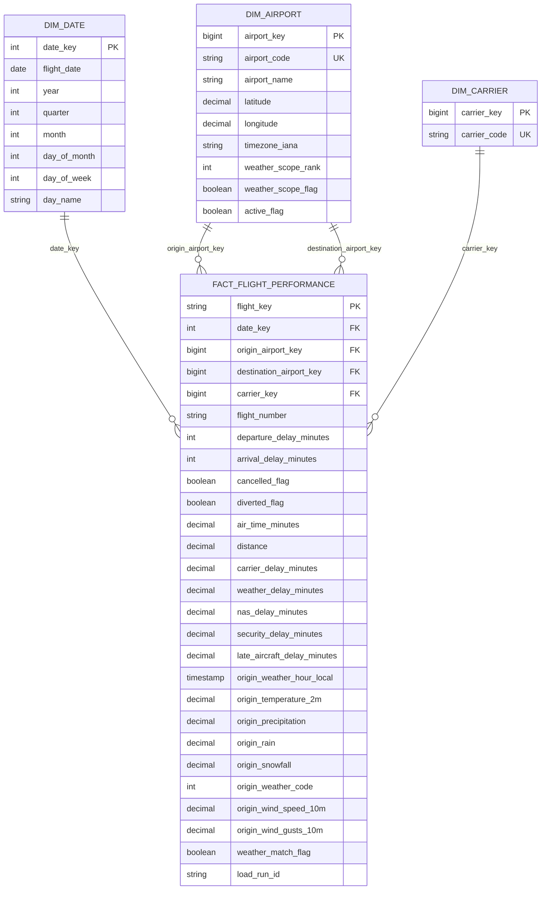

# AirOps 360 Gold Star Schema v0.1

**Status:** Draft for implementation  
**Model:** Dimensional star schema  
**Gold Lakehouse:** `lh_airops_gold`  
**Primary analytical fact:** `fact_flight_performance`  
**Evidence basis:** April 2026 BTS profiling, Data Contract v0.1, Airport Scope v0.1, Architecture v0.1  
**GitHub work item:** Issue #7 - Design Gold dimensional model

---

## 1. Purpose

This document defines the AirOps 360 Gold dimensional model used by the Direct Lake semantic model and Power BI reporting layer.

The model converts validated Silver flight and weather data into an analytics-oriented structure while preserving:

- deterministic flight identity
- dimensional relationships
- incremental-load compatibility
- idempotent reruns
- source lineage
- reconciliation
- operational auditability

The model is based on observed source evidence rather than assumptions made before profiling.

---

## 2. Evidence used

The Gold model is based on:

- `docs/DATA_CONTRACT.md`
- `docs/ARCHITECTURE.md`
- `docs/profiling/BTS_2026_04_PROFILE.md`
- `config/airports_v0.1.csv`
- `docs/DATA_SOURCES.md`

April 2026 BTS profiling established:

- 597,919 source rows
- 110 source columns
- 20 / 20 required AirOps fields present
- zero candidate-key null rows
- zero duplicate candidate-key groups
- 100% uniqueness for the provisional flight business key in the April batch

Candidate business key:

```text
FlightDate
+ Reporting_Airline
+ Flight_Number_Reporting_Airline
+ Origin
+ Dest
+ CRSDepTime
```

Later monthly batches must continue to validate this key.

---

## 3. Dimensional-model grain

### `fact_flight_performance`

Grain:

```text
one scheduled carrier flight occurrence
```

Each Gold fact row represents one accepted Silver flight identified by the deterministic `flight_key`.

### `dim_date`

Grain:

```text
one calendar date
```

### `dim_airport`

Grain:

```text
one distinct BTS airport code represented by an accepted flight
```

The dimension must support both origin and destination roles.

The top-15 weather scope does not restrict the analytical airport dimension to only 15 airports. Airports outside the weather scope may still occur as origins or destinations and must remain representable in the flight fact.

### `dim_carrier`

Grain:

```text
one Reporting_Airline carrier code
```

### `ops_load_audit`

Operational grain:

```text
one pipeline run + source/batch execution
```

`ops_load_audit` is an operational control table and is not a normal descriptive dimension in the analytical star.

---

## 4. Key strategy

### Flight key

`flight_key` remains the deterministic business-record identifier.

Canonical source key:

```text
YYYY-MM-DD|CARRIER|FLIGHT_NUMBER|ORIGIN|DEST|HHMM
```

Recommended implementation:

```text
SHA-256(canonical business key)
```

This key supports:

- deduplication
- idempotent reruns
- merge/upsert processing
- source-to-Gold traceability

### Dimension keys

Gold dimensions use stable surrogate keys:

- `date_key`
- `airport_key`
- `carrier_key`

Business keys remain present for traceability:

- `flight_date`
- `airport_code`
- `carrier_code`

---

## 5. `dim_date`

Primary key:

```text
date_key
```

Recommended key format:

```text
YYYYMMDD
```

Example:

```text
20260415
```

Attributes:

| Column | Purpose |
|---|---|
| `date_key` | Surrogate-style integer date key |
| `flight_date` | Calendar date |
| `year` | Calendar year |
| `quarter` | Calendar quarter |
| `month` | Month number |
| `day_of_month` | Day number |
| `day_of_week` | Day-of-week number |
| `day_name` | Human-readable day label |

The date dimension is generated deterministically from the AirOps project date range rather than inferred differently on each pipeline run.

---

## 6. `dim_airport`

Primary key:

```text
airport_key
```

Business key:

```text
airport_code
```

Attributes:

| Column | Purpose |
|---|---|
| `airport_key` | Stable Gold surrogate key |
| `airport_code` | BTS airport code |
| `airport_name` | Human-readable airport name where controlled metadata exists |
| `latitude` | Weather/API coordinate where available |
| `longitude` | Weather/API coordinate where available |
| `timezone_iana` | IANA timezone where available |
| `weather_scope_rank` | April 2026 volume rank for scoped airports |
| `weather_scope_flag` | Whether airport participates in Open-Meteo enrichment |
| `active_flag` | Controlled-reference active status where available |

The same airport dimension is role-played as:

```text
origin_airport_key
destination_airport_key
```

### Weather-scope handling

The controlled weather file currently uses these physical field names:

```text
iata_code
iana_timezone
rank
active
```

Silver/Gold mapping is explicit:

```text
iata_code      -> airport_code
iana_timezone  -> timezone_iana
rank           -> weather_scope_rank
active         -> active_flag
```

The top-15 configuration defines weather enrichment scope only. It does not define the complete population of airports that may appear in BTS flight records.

Non-weather-scope airports remain valid dimension members; weather-specific metadata may be NULL when no approved reference metadata is available.

---

## 7. `dim_carrier`

Primary key:

```text
carrier_key
```

Business key:

```text
carrier_code
```

Initial attributes:

| Column | Purpose |
|---|---|
| `carrier_key` | Stable Gold surrogate key |
| `carrier_code` | BTS `Reporting_Airline` code |

`carrier_name` is not required in Gold v0.1 because the accepted source contract currently guarantees the carrier code but does not yet define an authoritative carrier-name reference source.

A carrier name must not be fabricated or populated from an undocumented lookup.

---

## 8. `fact_flight_performance`

Grain:

```text
one scheduled carrier flight occurrence
```

Primary deterministic identifier:

```text
flight_key
```

### Dimension foreign keys

- `date_key`
- `origin_airport_key`
- `destination_airport_key`
- `carrier_key`

### Flight identifiers and operational attributes

- `flight_number`
- `crs_departure_time`
- `actual_departure_time`
- `crs_arrival_time`
- `actual_arrival_time`

### Flight-performance measures

- `departure_delay_minutes`
- `arrival_delay_minutes`
- `cancelled_flag`
- `diverted_flag`
- `air_time_minutes`
- `distance`
- `carrier_delay_minutes`
- `weather_delay_minutes`
- `nas_delay_minutes`
- `security_delay_minutes`
- `late_aircraft_delay_minutes`

### Origin weather enrichment

Weather is joined using:

```text
Origin airport + scheduled departure hour
```

Selected weather fields carried at flight grain:

- `origin_weather_hour_local`
- `origin_temperature_2m`
- `origin_precipitation`
- `origin_rain`
- `origin_snowfall`
- `origin_weather_code`
- `origin_wind_speed_10m`
- `origin_wind_gusts_10m`
- `weather_match_flag`

`visibility` remains optional and is not required by Gold v0.1.

### Lineage

The fact retains the end-to-end run identifier:

```text
load_run_id
```

This supports traceability from published flight records back to pipeline execution.

---

## 9. Why weather is enriched at flight grain

The Silver weather grain is:

```text
one airport + one local observation hour
```

The Gold flight grain is:

```text
one scheduled carrier flight occurrence
```

For the MVP, AirOps asks questions such as:

- Do flights departing during precipitation experience more delay?
- How does temperature relate to departure performance?
- Which airports show greater delay during adverse weather?
- How much delay is classified as weather related?

These questions are naturally evaluated after the relevant origin weather observation has been joined to each flight.

Therefore selected weather measurements are carried into `fact_flight_performance`.

Creating a `dim_weather` is intentionally avoided because temperature, precipitation, wind, and weather conditions are time-varying measurements rather than stable descriptive entities.

If future scope requires independent airport-hour weather analysis, AirOps may introduce a separate hourly weather fact after profiling and an approved architecture change.

---

## 10. `ops_load_audit`

`ops_load_audit` supports the Power BI Data Operations page and reconciliation.

Recommended fields:

| Column | Purpose |
|---|---|
| `run_id` | End-to-end execution ID |
| `source_name` | Logical source |
| `batch_key` | Deterministic source batch |
| `load_year` | Batch year |
| `load_month` | Batch month |
| `contract_version` | Governing data contract |
| `start_timestamp_utc` | Run/activity start |
| `end_timestamp_utc` | Run/activity end |
| `status` | STARTED / SUCCEEDED / FAILED |
| `source_row_count` | Raw source baseline |
| `processed_row_count` | Processed population |
| `rejected_row_count` | Quarantined records |
| `duplicate_row_count` | Deduplicated records |
| `weather_match_count` | Flights successfully enriched |
| `weather_unmatched_count` | Flights without weather match |
| `target_row_count` | Published target population |
| `error_message` | Failure details when applicable |

This table is operational rather than a descriptive business dimension.

---

## 11. Star-schema relationships



`ops_load_audit` is intentionally outside the analytical star relationship diagram because its grain is pipeline execution rather than business flight analysis.

---

## 12. Planned business measures

The Direct Lake semantic model can derive the following initial measures from Gold.

### Volume

```text
Total Flights
= COUNTROWS(fact_flight_performance)
```

### Cancellation

```text
Cancelled Flights
= SUM(cancelled_flag)

Cancellation Rate
= Cancelled Flights / Total Flights
```

### Diversion

```text
Diverted Flights
= SUM(diverted_flag)

Diversion Rate
= Diverted Flights / Total Flights
```

### Delay

```text
Average Departure Delay
= AVG(departure_delay_minutes)

Average Arrival Delay
= AVG(arrival_delay_minutes)

Total Carrier Delay Minutes
= SUM(carrier_delay_minutes)

Total Weather Delay Minutes
= SUM(weather_delay_minutes)

Total NAS Delay Minutes
= SUM(nas_delay_minutes)

Total Security Delay Minutes
= SUM(security_delay_minutes)

Total Late Aircraft Delay Minutes
= SUM(late_aircraft_delay_minutes)
```

### Flight characteristics

```text
Average Air Time
= AVG(air_time_minutes)

Average Distance
= AVG(distance)
```

### Weather enrichment

```text
Weather-Matched Flights
= SUM(weather_match_flag)

Weather Match Rate
= Weather-Matched Flights / Total Flights

Average Origin Temperature
= AVG(origin_temperature_2m)

Average Origin Precipitation
= AVG(origin_precipitation)
```

Measures must explicitly handle NULL values and divide-by-zero conditions in the semantic layer.

---

## 13. Reconciliation expectations

Gold publication must satisfy:

```text
accepted Silver flight business keys
=
Gold flight business keys represented after merge/upsert
```

Rerunning an unchanged monthly batch must not create duplicate `flight_key` records.

Weather enrichment must not change the flight fact grain.

A weather join must result in:

```text
one input flight
->
one Gold flight
```

not:

```text
one input flight
->
multiple Gold rows
```

Weather matched and unmatched counts must be recorded in `ops_load_audit`.

---

## 14. Gold model rules

1. `fact_flight_performance` remains one row per scheduled carrier flight occurrence.
2. Weather enrichment must never multiply flight rows.
3. The same `dim_airport` serves origin and destination roles.
4. The weather top-15 scope must not restrict the full airport dimension.
5. `dim_carrier` uses verified carrier codes only.
6. Unsupported carrier labels or metadata must not be fabricated.
7. Dimension surrogate keys must remain stable across reruns.
8. `flight_key` remains available for idempotency and traceability.
9. Gold contains only records that passed required Silver quality gates.
10. Gold publication is subject to reconciliation.
11. `ops_load_audit` remains operational and is not treated as a normal descriptive dimension.
12. Material changes to grain or model structure require an explicit architecture decision.

---

## 15. Implementation order

Gold implementation should occur after the required Silver standardized datasets exist.

Recommended order:

1. Build `dim_date`.
2. Build/merge `dim_airport`.
3. Build/merge `dim_carrier`.
4. Resolve dimension surrogate keys into accepted Silver flights.
5. Join scoped origin weather at scheduled local departure hour.
6. Build/merge `fact_flight_performance`.
7. Run grain and uniqueness validation.
8. Reconcile accepted Silver business keys to Gold.
9. Persist `ops_load_audit` metrics.
10. Expose Gold Delta tables through Direct Lake.

---

## 16. Acceptance criteria for schema v0.1

The draft is accepted when it documents:

- fact grain
- dimension grains
- deterministic flight identity
- business and surrogate keys
- role-playing airport relationships
- flight-performance measures
- weather enrichment fields
- weather-at-flight-grain rationale
- operational audit grain and metrics
- reconciliation behavior
- rerun/idempotency requirements
- Mermaid relationship diagram
- implementation sequence

This design remains a draft until implementation validates Silver-to-Gold behavior on real monthly batches.
